# Tài liệu thuật toán và GIF trace

Tài liệu này gom lý thuyết ngắn, cách đọc trace, và GIF chạy từng thuật toán của **8-Puzzle Detective Lab**. Mỗi GIF được Playwright ghi từ chính giao diện React: chọn đúng nhóm/alias, bấm **Chạy thuật toán**, mở lần lượt các dòng trace rồi chụp panel thật. Đây không phải ảnh minh họa chọn ngẫu nhiên hoặc vẽ tay.

## Ranh giới học thuật

Repo học theo cách phân loại của `Exercise_AI_FinalExam`: không ép mọi thuật toán thành solver 8-Puzzle chuẩn.

| Nhóm | Vai trò trong app | Lưu ý |
|---|---|---|
| Uninformed, Informed | Solver state-space chuẩn | Có thể trả đường đi hợp lệ nếu tìm thấy. |
| Local Search | Demo tối ưu cục bộ trên landscape heuristic | Simple/Steepest/Stochastic đi theo một trajectory; Local Beam giữ `k=3` state song song. |
| Complex Environments | Mô hình môi trường mở rộng | Minh họa belief, online learning, nondeterminism. |
| CSP | Mô hình hóa/giải ràng buộc bounded horizon | Backtracking dùng legal transition; Min-Conflicts là local repair, không claim legal path. |
| Adversarial/Stochastic | Demo Caro 3x3 | Dùng cây game/chance giới hạn depth, không claim 8-Puzzle có đối thủ tự nhiên. |

## Cách sinh lại GIF

```powershell
python scripts\generate_algorithm_gifs.py
python scripts\generate_algorithm_gifs.py --check
```

Output nằm ở `docs/assets/algorithm-gifs/`, kèm `manifest.json`. Hiện có 22 GIF, đúng với 22 thuật toán đang hiển thị.

`manifest.json` lưu `source: web-ui-playwright`, số frame và SHA-256 của từng GIF. Lệnh `--check` sẽ thất bại nếu GIF không phải web capture, sai checksum hoặc thiếu alias.

## Mức claim được phép nói

| Loại | Được nói | Không nên nói |
|---|---|---|
| BFS/UCS/IDS/A*/IDA* | Solver 8-Puzzle chuẩn, có certificate khi đủ điều kiện | Mọi run bounded đều chứng minh tối ưu nếu bị limit |
| DFS/Greedy/Local Search | Demo trade-off/failure mode | Solver đáng tin cậy hơn A* |
| Complex Environments | Concept lab cho belief, nondeterminism, online learning | Cùng mô hình chuẩn với 8-Puzzle offline |
| CSP Backtracking | Bounded transition-CSP demo bằng legal moves | Proof unsolvable toàn cục |
| Min-Conflicts | Local repair assignment, có thể giảm conflict | Legal blank-move solution |
| Minimax/Alpha-Beta/Expectimax | Depth-bounded Caro game/chance tree | Solver tự nhiên của 8-Puzzle |

## GIF gallery

| Thuật toán | Alias | Nhóm | GIF |
|---|---:|---|---|
| BFS | `bfs` | Uninformed Search | 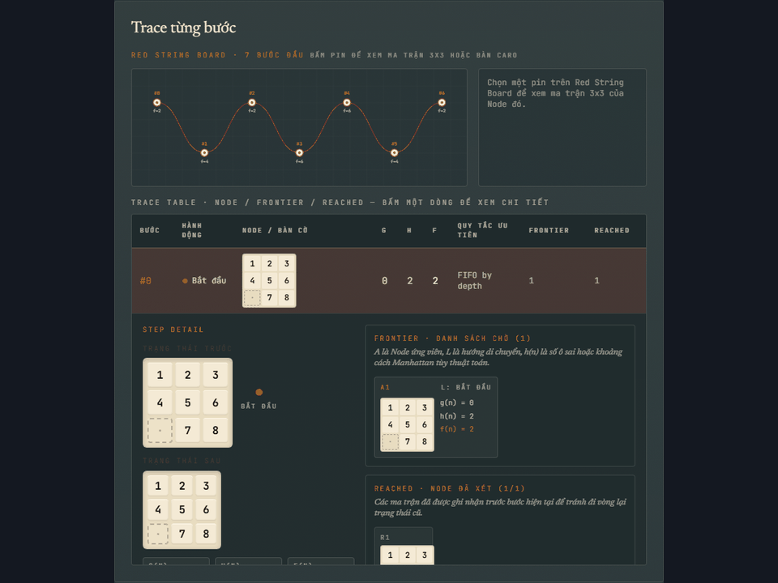 |
| DFS | `dfs` | Uninformed Search |  |
| UCS | `ucs` | Uninformed Search |  |
| IDS | `ids` | Uninformed Search | 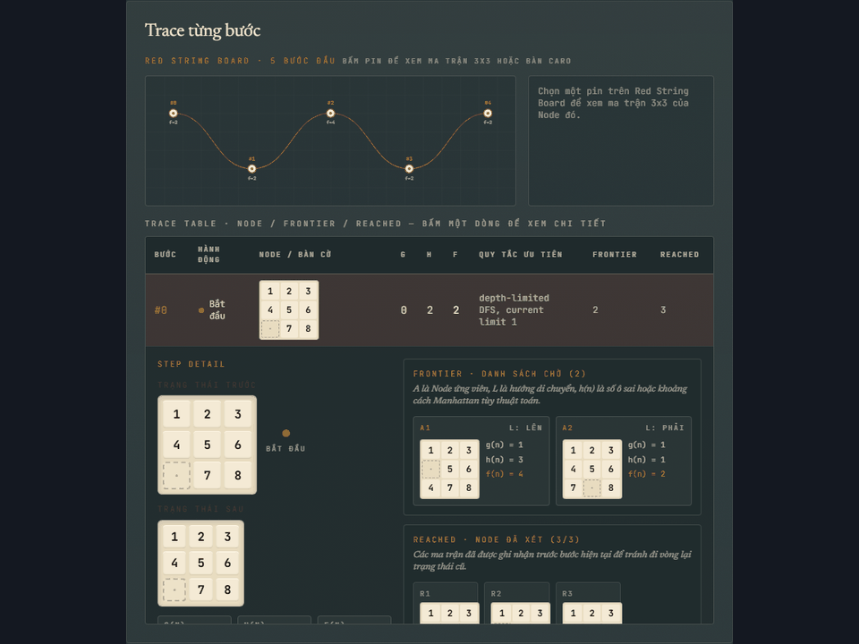 |
| Greedy | `greedy` | Informed Search |  |
| A* | `astar` | Informed Search | 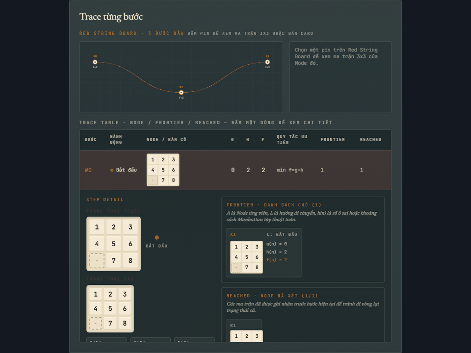 |
| IDA* | `ida` | Informed Search |  |
| Simple Hill Climbing | `simple-hill-climbing` | Local Search | 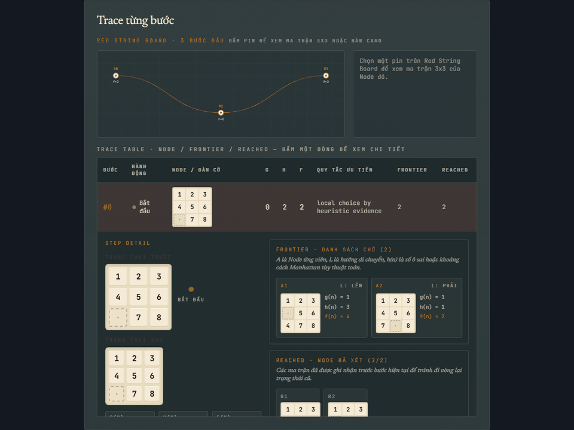 |
| Steepest-Ascent Hill Climbing | `hill-climbing` | Local Search |  |
| Stochastic Hill Climbing | `stochastic-hill-climbing` | Local Search | 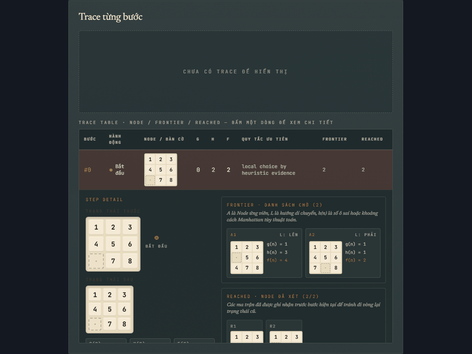 |
| Local Beam Search | `beam` | Local Search | 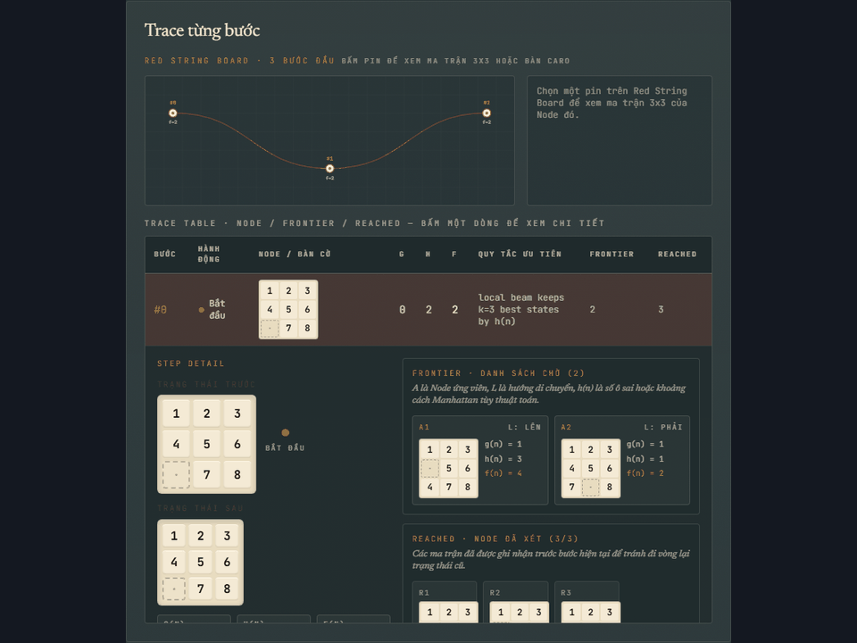 |
| Simulated Annealing | `simulated-annealing` | Local Search |  |
| AND-OR Search | `and-or` | Complex Environments | 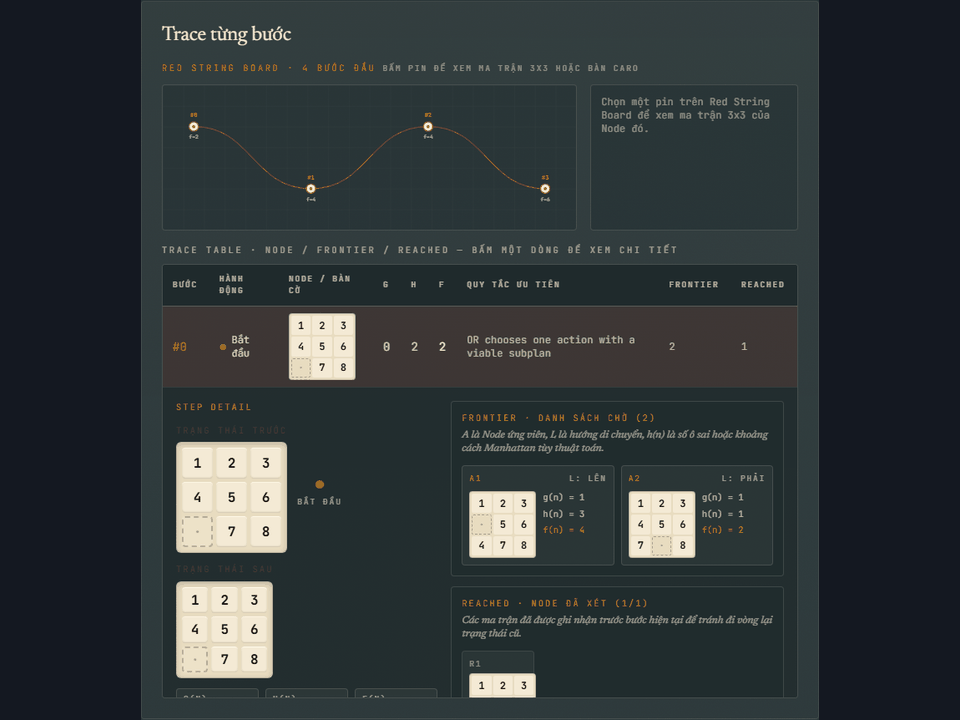 |
| No Observation Search | `no-observation` | Complex Environments |  |
| Partially Observable Search | `partial-observation` | Complex Environments | 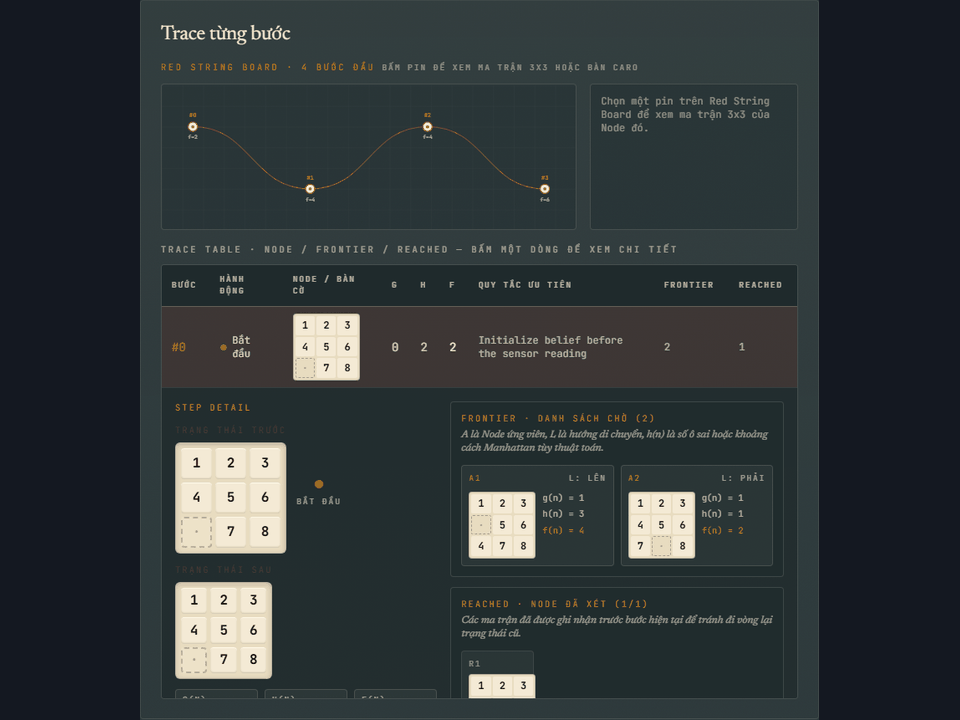 |
| Online Search | `online` | Complex Environments | 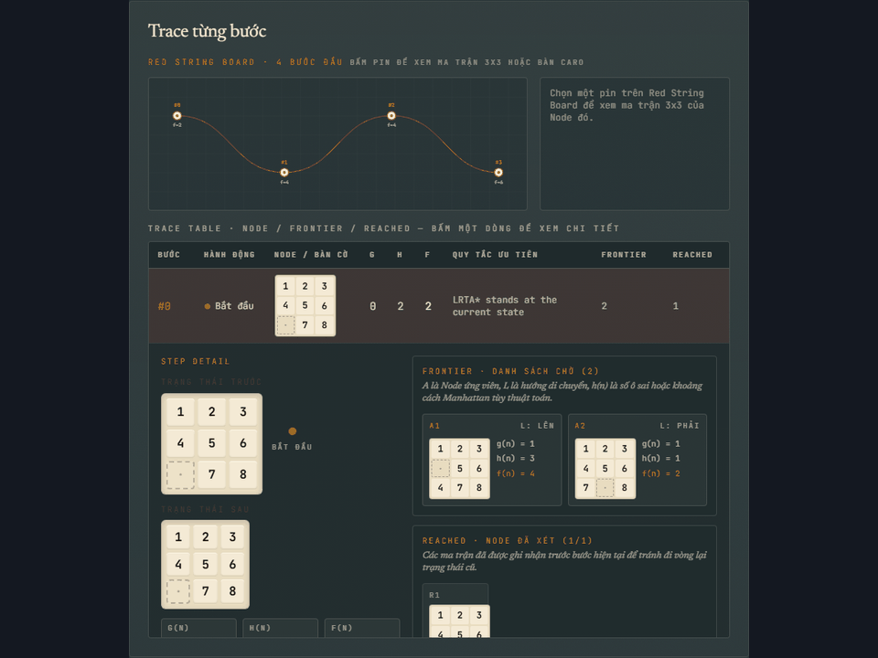 |
| CSP Definition | `csp` | Constraint Satisfaction Problems | 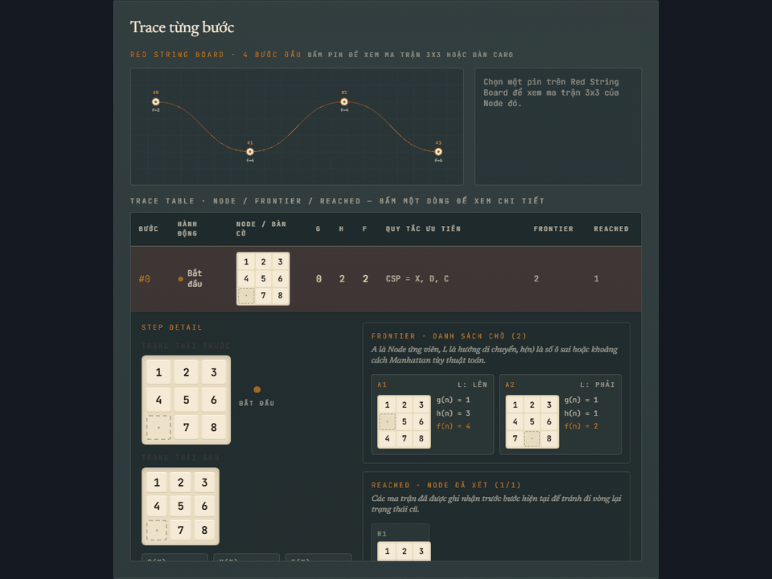 |
| CSP Backtracking | `csp-backtracking` | Constraint Satisfaction Problems | 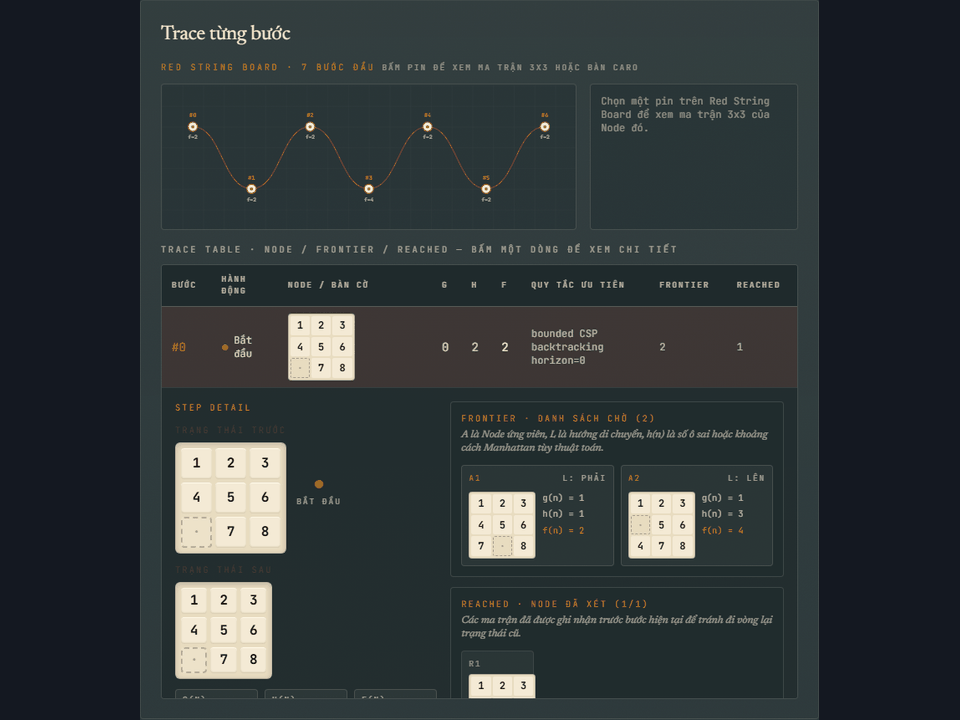 |
| Min-Conflicts | `min-conflicts` | Constraint Satisfaction Problems | 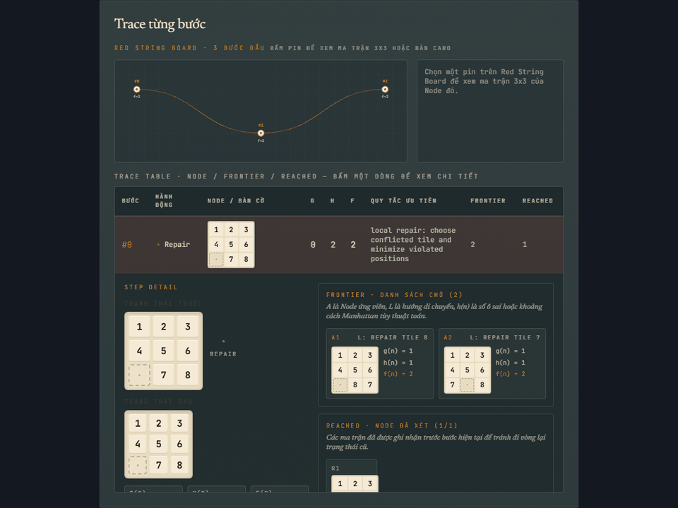 |
| Minimax | `minimax` | Adversarial / Stochastic Search | 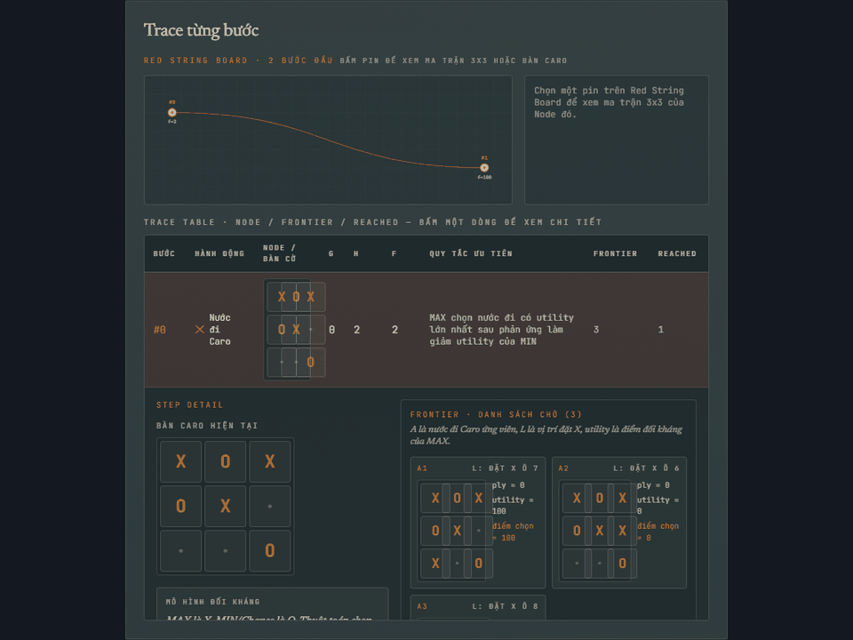 |
| Alpha-Beta Pruning | `alpha-beta` | Adversarial / Stochastic Search | 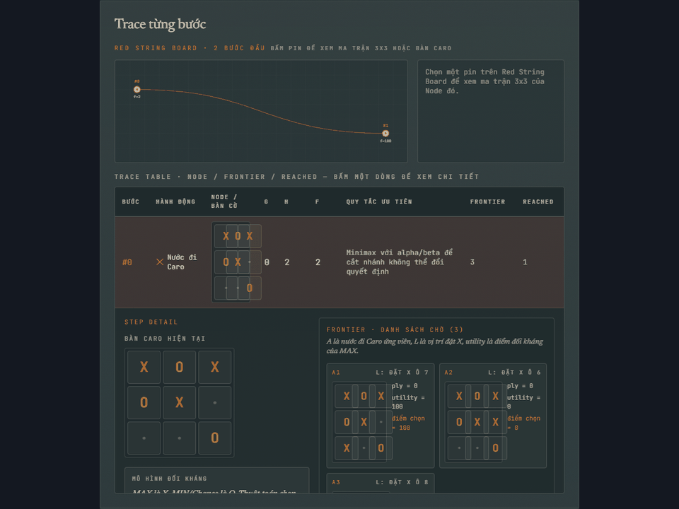 |
| Expectimax | `expectimax` | Adversarial / Stochastic Search |  |

## Ghi chú từng nhóm

### Uninformed Search

| Thuật toán | Ý tưởng | Frontier | Complete | Optimal |
|---|---|---|---|---|
| BFS | Mở node theo từng lớp depth. | FIFO queue | Có | Có với step cost = 1 |
| DFS | Đi sâu trước, quay lui khi cụt. | Stack/LIFO | Không đảm bảo nếu không giới hạn | Không |
| UCS | Luôn mở node có `g(n)` nhỏ nhất. | Priority queue theo `g` | Có nếu cost dương | Có |
| IDS | Chạy depth-limited DFS với limit tăng dần. | DFS lặp | Có nếu đủ depth | Có với step cost = 1 |

### Informed Search

| Thuật toán | Hàm chọn | Điểm mạnh | Rủi ro |
|---|---|---|---|
| Greedy | `h(n)` | Nhanh, dễ hiểu | Dễ mắc bẫy heuristic, không tối ưu |
| A* | `f(n)=g(n)+h(n)` | Tối ưu với heuristic admissible/consistent | Tốn bộ nhớ |
| IDA* | DFS theo ngưỡng `f` | Ít bộ nhớ hơn A* | Re-expand nhiều node |

### Local Search

Local Search chỉ nhìn trạng thái hiện tại và láng giềng, nên GIF thể hiện trajectory cục bộ thay vì cây tìm kiếm đầy đủ.

| Thuật toán | Cách chọn bước | Failure mode hay gặp |
|---|---|---|
| Simple Hill Climbing | Láng giềng đầu tiên cải thiện `h` | Kẹt local optimum |
| Steepest-Ascent | Láng giềng tốt nhất | Plateau/ridge |
| Stochastic Hill Climbing | Chọn ngẫu nhiên trong nhóm cải thiện | Phụ thuộc seed |
| Local Beam Search | Giữ `k=3` trạng thái tốt nhất mỗi vòng | Beam hẹp mất nghiệm |
| Simulated Annealing | Có thể nhận bước xấu theo nhiệt độ | Schedule kém hội tụ |

### Complex Environments

| Thuật toán | Dạy khái niệm | Output trong app |
|---|---|---|
| AND-OR | Kế hoạch có điều kiện cho kết quả bất định | Policy model trace |
| No Observation | Belief-state khi không có sensor | Belief update trace |
| Partial Observation | Lọc belief bằng quan sát một phần | Sensor/filter/action trace |
| Online Search | Agent học heuristic khi đang đi | LRTA*-style trace |

### CSP

| Thuật toán | Dạy khái niệm | Lưu ý |
|---|---|---|
| CSP Definition | `X, D, C`, horizon, constraints | Mô hình hóa, không tự là solver |
| CSP Backtracking | Backtracking theo horizon, mỗi transition vẫn là legal blank move | Bounded horizon; fail không chứng minh unsolvable |
| Min-Conflicts | Local repair trên assignment vi phạm bằng swap giảm conflict | Có thể đạt arrangement goal nhưng không bảo đảm legal blank-move path |

### Adversarial / Stochastic Search

| Thuật toán | Mô hình | Lưu ý |
|---|---|---|
| Minimax | MAX chọn nước đi tốt nhất trong worst-case MIN | Cây Caro 3x3 giới hạn depth |
| Alpha-Beta | Minimax + cắt nhánh bằng `alpha`, `beta` | Có thống kê node/pruned branch |
| Expectimax | MAX + chance node kỳ vọng xác suất | Cây chance giới hạn depth, không cắt như Alpha-Beta |
