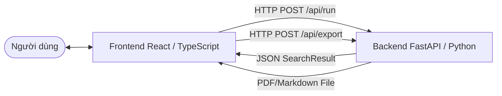

# Kiến trúc Hệ thống (System Architecture)

Hệ thống **8-Puzzle Detective Lab** hoạt động theo mô hình Kiến trúc Client - Server tách biệt, tối ưu hóa giao tiếp thời gian thực qua giao thức HTTP REST.

## 1. Biểu đồ Kiến trúc tổng quát



- **Client (React App):** Đảm nhận vai trò hiển thị trạng thái trò chơi trực quan, cho phép người dùng cấu hình dữ liệu đầu vào (Start, Goal, Algorithm, Heuristic) và phân tích báo cáo khám nghiệm (Autopsy).
- **Server (FastAPI App):** Đảm nhận toàn bộ khối lượng tính toán nặng. Chạy các thuật toán tìm kiếm, ghi nhận từng thay đổi của hàng đợi Frontier, chấm điểm heuristic và xuất các định dạng báo cáo.

---

## 2. Luồng dữ liệu chạy Thuật toán (Execution Data Flow)

Khi người dùng nhấn nút **"Chạy thuật toán"** trên giao diện:

1. **Thu thập cấu hình:** Frontend đóng gói các thông tin trạng thái ban đầu (ví dụ: `[1, 2, 3, 4, 5, 6, 0, 7, 8]`), trạng thái đích, thuật toán mong muốn (ví dụ: `astar`) và hàm heuristic (`manhattan`).
2. **Gửi yêu cầu:** Gửi một API Request `POST /api/run` kèm JSON payload đến server FastAPI.
3. **Phân phối thuật toán:** Router `/api/run` tiếp nhận request, gọi hàm `solve()` trong `api/eight_puzzle_detective_core.py`.
4. **Tìm kiếm trạng thái (Search Loop):**
   - Lõi thuật toán khởi tạo `Frontier` (Hàng đợi/Heap) chứa node ban đầu.
   - Bắt đầu vòng lặp: Lấy node tốt nhất ra khỏi Frontier, kiểm tra xem đã là Goal chưa.
   - Sinh các láng giềng hợp lệ (Successors), tính toán điểm `g(n)`, `h(n)`, `f(n)`.
   - Mỗi bước duyệt, lõi thuật toán lưu lại một dòng log chứa: cấu hình Frontier hiện tại, cấu hình trạng thái của Node được chọn, điểm đánh giá và lý do chọn Node đó.
5. **Khám nghiệm (Autopsy Analysis):** Sau khi tìm kiếm hoàn tất (hoặc kết thúc do đạt giới hạn số bước mở rộng `max_expansions`), hệ thống phân tích kết quả để đưa ra đánh giá về tính tối ưu, tính đầy đủ và bẫy cực tiểu cục bộ.
6. **Trả về kết quả:** Server phản hồi bằng một cấu trúc JSON `SearchResult` chi tiết. Frontend nhận kết quả và render trực quan lên màn hình Trace Matrix.

---

## 3. Cấu trúc đối tượng giao tiếp JSON (JSON Payloads)

### Request Payload (`POST /api/run`)
```json
{
  "start": [1, 2, 3, 4, 5, 6, 0, 7, 8],
  "goal": [1, 2, 3, 4, 5, 6, 7, 8, 0],
  "algorithm": "astar",
  "heuristic": "manhattan",
  "max_expansions": 500
}
```

---

## 3.1 Tài liệu thuật toán và GIF trace

- Tài liệu thuật toán nằm ở `docs/algorithms/index.md`.
- GIF trace nằm ở `docs/assets/algorithm-gifs/*.gif`.
- `scripts/capture_web_algorithm_frames.mjs` dùng Playwright mở giao diện thật, chọn đúng alias, chạy thuật toán và chụp lần lượt các dòng trace; `scripts/generate_algorithm_gifs.py` ghép các frame web thành GIF. Local Beam giữ `k=3` trạng thái; CSP Backtracking dùng legal transition trong horizon giới hạn; Min-Conflicts render local repair; nhóm Adversarial/Stochastic render cây Caro/chance giới hạn độ sâu.
- `docs/assets/algorithm-gifs/manifest.json` ghi alias, group, file, số frame, nguồn `web-ui-playwright` và SHA-256 để kiểm tra asset.
- Frontend dùng `import.meta.glob` trong `web/src/components/algorithm-gif-panel.tsx` để bundle chính các GIF này và hiển thị GIF tương ứng với alias đang chọn.

Các certificate chuyên biệt ghi rõ ranh giới mô hình: `local-beam-search`, `csp-backtracking-bounded`, `min-conflicts-local-repair` và `caro-adversarial-demo`. Caro còn báo `game_tree_depth`, `nodes_evaluated`, `pruned_branches` để trace có bằng chứng thay vì chỉ mô tả một bước.

### Response Payload (`SearchResult` JSON)
```json
{
  "found": true,
  "message": "A* search solved the puzzle.",
  "path": [[1,2,3,4,5,6,0,7,8], [1,2,3,4,5,6,7,8,0]],
  "actions": ["Right"],
  "path_cost": 1,
  "expanded": 2,
  "generated": 2,
  "max_frontier": 2,
  "runtime_ms": 1.25,
  "trace_rows": [
    {
      "step": 1,
      "node": [1,2,3,4,5,6,0,7,8],
      "g": 0,
      "h": 1,
      "f": 1,
      "priority_rule": "Chọn node có f(n) nhỏ nhất",
      "explanation": "Khởi tạo tìm kiếm A*.",
      "frontier_before": []
    }
  ],
  "autopsy": {
    "completeness": "Có",
    "optimality": "Có (h admissible)",
    "local_minimum_trap": "Không",
    "details": "A* kết hợp khoảng cách Manhattan tìm ra đường đi tối ưu."
  }
}
```

---

## 4. Logic tìm kiếm đối kháng Caro (Minimax & Alpha-Beta)

Đối với các thuật toán đối kháng/xác suất (`Minimax`, `Alpha-Beta Pruning`, `Expectimax`), hệ thống chuyển đổi từ không gian trạng thái 8-Puzzle sang game **Cờ Caro 3x3 (Tic-Tac-Toe)**:

- **State:** Đại diện bởi trạng thái bàn cờ Caro gồm các ô `X`, `O` hoặc `.` (ô trống).
- **Hành động (Actions):** Đặt ký hiệu của người chơi (`X` hoặc `O`) vào các ô trống còn lại trên bàn.
- **Giá trị lượng giá (Utility):** 
  - `+100` nếu `X` (MAX) thắng.
  - `-100` nếu `O` (MIN) thắng.
  - `0` nếu hòa cờ.
  - Với các trạng thái chưa kết thúc, hàm đánh giá heuristic tính số lượng hàng/cột/chéo có thể thắng của MAX trừ đi MIN.
- **Alpha-Beta Pruning:** Sử dụng hai biến giới hạn `alpha` (giá trị tối thiểu mà người chơi MAX chắc chắn đạt được) và `beta` (giá trị tối đa mà người chơi MIN chắc chắn đạt được) để bỏ qua việc duyệt qua các nhánh con không làm thay đổi quyết định ở node cha.
